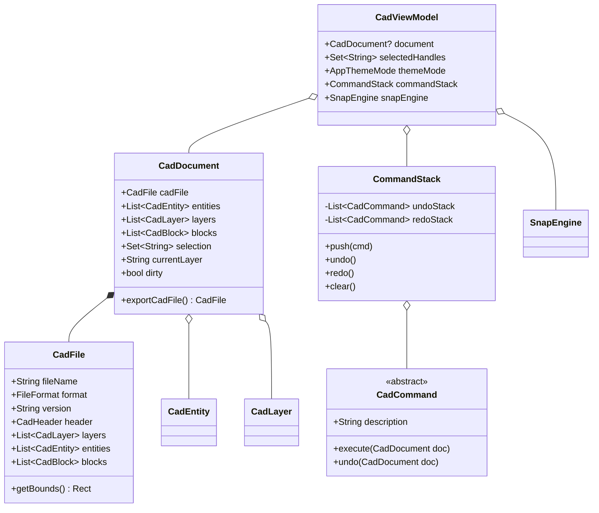
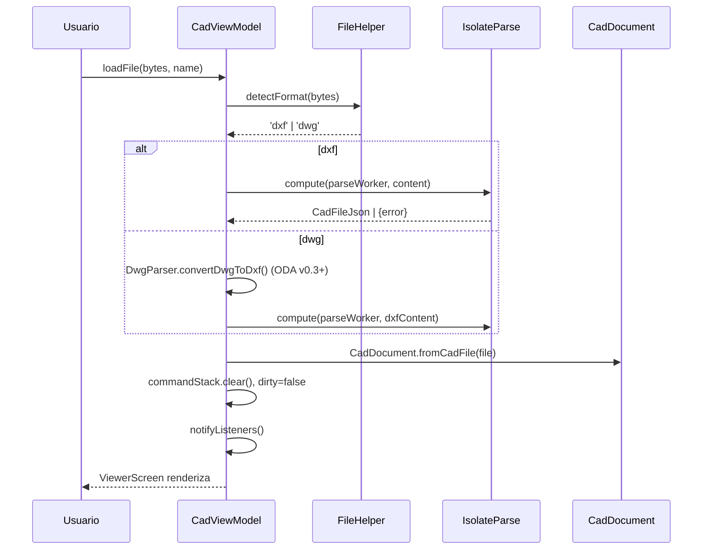
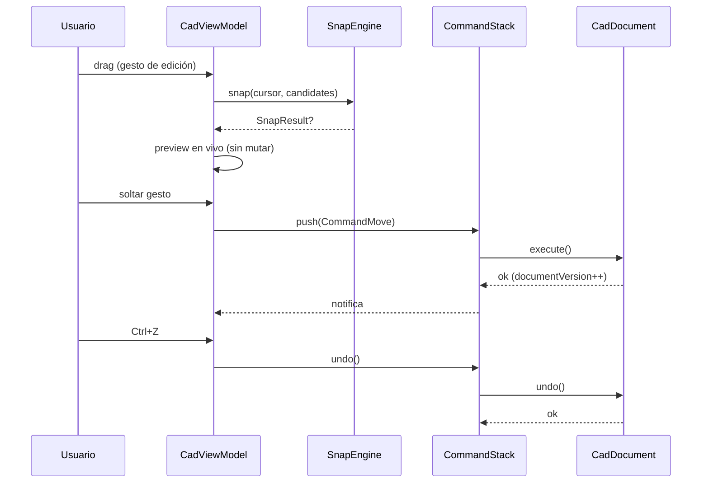

# Arquitectura — CAD Viewer & Editor

**Versión:** 0.3.0 · **Estado:** Aprobado (arquitectura técnica)
**Equipo responsable:** Arquitecto Técnico  
**Fecha:** 2026-07-31
**Propósito:** Arquitectura de la aplicación Flutter CAD Viewer & Editor: capas, módulos, flujos de datos y patrones. Complementa a `docs/DATA_MODEL.md`, `docs/SERIALIZATION.md` y `docs/DEVELOPMENT.md`.

---

## 1. Principios arquitectónicos

1. **Separación por capas** — `models` (puro Dart, sin Flutter) → `parsers` → `renderers` → `controllers` → `screens/widgets`. Las capas internas no dependen de las externas.
2. **Modelo de dominio inmutable donde sea posible** — `CadEntity` con `copyWith` para facilitar edición y undo.
3. **Edición mediante patrón Command** — cada operación de edición es un comando ejecutable/deshacible (ver ADR-0004).
4. **Estado centralizado** — `CadViewModel` (ChangeNotifier) como única fuente de verdad de la sesión (ver ADR-0001).
5. **Procesamiento pesado fuera del hilo de UI** — parseo y escritura DXF en Isolates (ver ADR-0002/0003).
6. **Privacidad por diseño** — todo el procesamiento es local (ver ADR-0005).

---

## 2. Vista general (diagrama de capas)

```
┌──────────────────────────────────────────────────────────────┐
│                    PRESENTATION (UI)                          │
│  screens/        home_screen, viewer_screen, layer_panel     │
│  widgets/        zoom_controls, property_panel, command_bar, │
│                  toolbar_edit, recent_files_list, grip_layer │
├──────────────────────────────────────────────────────────────┤
│                    CONTROLLERS (STATE)                       │
│  controllers/    cad_view_model.dart                         │
│                  command_stack.dart   (undo/redo)            │
│                  snap_engine.dart     (snapping)             │
│                  selection_manager.dart                      │
├──────────────────────────────────────────────────────────────┤
│                    RENDERERS (VIEW)                          │
│  renderers/      cad_painter.dart, layer_manager.dart        │
│                  grip_renderer.dart, snap_renderer.dart      │
│                  grid_renderer.dart, axis_renderer.dart      │
├──────────────────────────────────────────────────────────────┤
│                    DOMAIN (MODELS) — Dart puro               │
│  models/         cad_file, cad_entity, cad_layer, cad_block, │
│                  cad_document (sesión editable), cad_enums   │
├──────────────────────────────────────────────────────────────┤
│                    PARSERS / WRITERS (DATA)                  │
│  parsers/        dxf_parser.dart (lectura),                  │
│                  dxf_writer.dart (escritura),                │
│                  dwg_parser.dart (conversión externa)        │
│  utils/          coordinate_transform, file_helper, units,   │
│                  geometry (math), aci_colors                 │
└──────────────────────────────────────────────────────────────┘
```

Regla de dependencias: una capa solo puede depender de sí misma y de las capas internas. Nunca al revés.

---

## 3. Módulos y responsabilidades

### 3.1 `models/` — Dominio (Dart puro, sin Flutter)

| Archivo | Contenido |
|---------|-----------|
| `cad_file.dart` | `CadFile` (contenido del archivo: header, layers, entities, blocks) + `CadHeader` |
| `cad_entity.dart` | `CadEntity` base + 14 subtipos con `copyWith` |
| `cad_layer.dart` | `CadLayer` (name, aci, lineType, visible, locked, frozen, displayColor, lineWeight) |
| `cad_block.dart` | `CadBlock` (name, basePoint, entities) |
| `cad_document.dart` | **`CadDocument`**: estado de sesión editable — entities, layers, blocks, selection, `dirty` flag, versión |
| `cad_enums.dart` | `CadEntityType`, `DimType`, `SnapMode`, `UnitsType`, `GridType` |

> `CadDocument` es la pieza clave para edición: envuelve un `CadFile` y mantiene estado mutable de sesión sin tocar el archivo original. Ver `docs/DATA_MODEL.md`.

### 3.2 `parsers/` — Lectura y escritura de archivos

| Archivo | Contenido |
|---------|-----------|
| `dxf_parser.dart` | `DxfParserWrapper` — usa paquete `dxf ^1.3.0`, convierte a `CadFile` (correr en Isolate) |
| `dxf_writer.dart` | `DxfWriter` — serializa `CadFile`/`CadDocument` a DXF ASCII R12/R2000 (correr en Isolate) |
| `dwg_parser.dart` | `DwgParser` — MVP: mensaje + guía; v0.3+: invoca ODA File Converter (CLI) y delega en DxfParser |

### 3.3 `renderers/` — Dibujo en canvas

| Archivo | Contenido |
|---------|-----------|
| `cad_painter.dart` | `CadPainter` — renderiza entidades visibles, selección, grips, snap indicators |
| `layer_manager.dart` | Filtrado por capas visibles/descongeladas, color por capa |
| `grid_renderer.dart` | Grid cartesiano/polar/isométrico adaptado a escala |
| `axis_renderer.dart` | Ejes X/Y con flechas y etiquetas |
| `grip_renderer.dart` | Grips de edición (cuadrados/rombos según tipo) |
| `snap_renderer.dart` | Marcador visual del snap activo |

### 3.4 `controllers/` — Estado y lógica de interacción

| Archivo | Contenido |
|---------|-----------|
| `cad_view_model.dart` | `CadViewModel` — estado de sesión, carga/guardado, temas, unidades, delegación a sub-sistemas |
| `command_stack.dart` | `CommandStack` — pila undo/redo (límite 100), ejecución de `CadCommand` |
| `snap_engine.dart` | `SnapEngine` — resolución de snaps sobre entidades visibles |
| `selection_manager.dart` | `SelectionManager` — conjunto de handles, ventana/crucero, reglas de capa bloqueada |

### 3.5 `screens/` y `widgets/` — UI

| Archivo | Contenido |
|---------|-----------|
| `screens/home_screen.dart` | Home: abrir archivo, recientes, ajustes |
| `screens/viewer_screen.dart` | Viewer: canvas + InteractiveViewer + gestos + paneles |
| `screens/layer_panel.dart` | Panel de capas (bottom sheet / lateral) |
| `widgets/property_panel.dart` | Propiedades de entidad seleccionada |
| `widgets/zoom_controls.dart` | Zoom +/-, fit-to-screen |
| `widgets/command_bar.dart` | Línea de comandos / entrada de coordenadas |
| `widgets/toolbar_edit.dart` | Toolbar contextual de edición (mover, rotar, escalar, borrar...) |
| `widgets/recent_files_list.dart` | Recientes horizontales |

### 3.6 `utils/` — Utilidades puras

| Archivo | Contenido |
|---------|-----------|
| `coordinate_transform.dart` | Transformación mundo↔canvas, bounds, fit-to-screen |
| `geometry.dart` | Geometría analítica: distancia punto-segmento, intersecciones, área, ángulos |
| `units.dart` | Conversión y formateo de unidades (mm base) |
| `aci_colors.dart` | Mapa ACI → Color con override por tema |
| `file_helper.dart` | Detección de formato, lectura segura, rutas |

---

## 4. Flujos de datos principales

### 4.1 Apertura de archivo (lectura)

```
HomeScreen → FilePicker (bytes/ruta)
    ↓
FileHelper.detectFormat()          → 'dxf' | 'dwg'
    ↓
[dxf]   Isolate: DxfParserWrapper.parse(bytes) → CadFile
[dwg]   MVP: dialog guía / v0.3+: ODA CLI → DXF temporal → parse
    ↓
CadDocument.fromCadFile(cadFile)   → estado editable (selection vacía, dirty=false)
    ↓
CadViewModel.setDocument(doc)  → notifyListeners()
    ↓
ViewerScreen: CadPainter(visibleEntities, selection, theme)
    + addRecentFile()
```

### 4.2 Edición con Command (patrón)

```
Usuario: MOVE entidades → GestureDetector detecta drag
    ↓
CadViewModel.beginMove(targets, basePoint)
    ↓
Cada frame: preview (sin mutar) → grips/cursor siguen al dedo
    ↓
Al soltar: CommandMove(targets, delta).execute() → CadDocument.apply()
    ↓
CommandStack.push(cmd) → dirty=true → notifyListeners()
    ↓
CadPainter repinta; CommandBar muestra "MOVE OK"
    ↓
Ctrl+Z → CommandStack.undo() → CadDocument.revert() → dirty según pila
```

### 4.3 Guardado (escritura)

```
Toolbar/Comando: SAVE
    ↓
CadDocument.exportCadFile()  → CadFile limpio (sin estado de sesión)
    ↓
Isolate: DxfWriter.write(cadFile, version: R2000) → String
    ↓
FileHelper.writeFile(path, content, flush: true)  → try-catch + SnackBar
    ↓
CadDocument.markSaved() → dirty=false → notifyListeners()
```

### 4.4 Snapping (resolución)

```
Pointer sobre canvas → SnapEngine.snap(cursorWorld, candidates)
    ↓
Para cada SnapMode activo → calcular puntos candidatos sobre entidades visibles
    ↓
Elegir el más cercano dentro de tolerancia (px→mundo, adaptada al zoom)
    ↓
Retornar SnapResult(punto, tipo, entidad) → SnapRenderer lo pinta
    ↓
El comando de dibujo usa el punto snapped (o el crudo si no hay snap)
```

---

## 5. Gestión de estado detallada

### 5.1 CadViewModel — propiedades

| Propiedad | Tipo | Uso |
|-----------|------|-----|
| `document` | `CadDocument?` | Sesión editable actual |
| `selectedHandles` | `Set<String>` | Selección actual (delegada a SelectionManager) |
| `visibleLayers` | `Set<String>` | Capas visibles |
| `currentLayer` | `String` | Capa activa para nuevas entidades |
| `scale`, `offset` | `double`, `Offset` | Transformación de vista |
| `units` | `UnitsType` | Unidad de visualización |
| `snapSettings` | `SnapSettings` | Modos de snap activos |
| `themeMode` | `AppThemeMode` | Tema seleccionado |
| `commandStack` | `CommandStack` | Undo/redo |
| `isLoading`, `error` | `bool`, `String?` | Estado de carga |
| `dirty` | `bool` | Hay cambios sin guardar |

### 5.2 Version counters (rebuild selectivo)

| Contador | Afecta a |
|----------|----------|
| `documentVersion` | CadPainter, PropertyPanel |
| `layersVersion` | LayerPanel |
| `selectionVersion` | ToolbarEdit, PropertyPanel, GripLayer |
| `transformVersion` | StatusBar (coordenadas), GridLayer |
| `commandVersion` | CommandBar, botones undo/redo |

### 5.3 Patrón de lectura

- `context.watch<CadViewModel>()` en widgets que dependen de casi todo el estado (ViewerScreen).
- `context.select((vm) => vm.layersVersion)` para rebuild selectivo (LayerPanel).

---

## 6. Concurrencia e Isolates

| Operación | Hilo | Justificación |
|-----------|------|---------------|
| Parseo DXF | Isolate (`compute`) | No bloquear UI en archivos > 1 MB |
| Escritura DXF | Isolate (`compute`) | Serialización pesada |
| Hit-testing (selección) | UI, con estructura de aceleración | Latencia < 16 ms requerida |
| Snap engine | UI, con cache de geometría | Resolución por frame |
| Renderizado | UI (CustomPainter) | Obligatorio |

**Estructura de aceleración para hit-testing/culling:** Spatial hash grid o R-Tree sobre las entidades visibles, reconstruido tras cada cambio de documento (en Isolate si es costoso).

---

## 7. Manejo de errores transversal

```
try { ... } 
on FormatException/parseError { error='No se pudo leer el archivo. ¿Es un DXF válido?' }
on PathNotFoundException { error='Archivo no encontrado' }
catch (e) { error='Error inesperado: $e' }
→ siempre: SnackBar/Dialog + log en consola + estado vacío seguro
```

Ver `docs/RULES.md` sección B para las reglas obligatorias de manejo de errores.

---

## 8. Diagramas formales (Mermaid)

> Renderizan en GitHub. Ver también `docs/UX_FLOWS.md` (flujos de usuario) y `docs/SERIALIZATION.md` (contratos).

### 8.1 Diagrama de clases (dominio)



### 8.2 Secuencia: apertura y parseo



### 8.3 Secuencia: edición con Command



---

## 9. Diagrama de paquetes (resumen pubspec)

```yaml
dependencies:
  flutter: {sdk: flutter}
  provider: ^6.1.1
  dxf: ^1.3.0
  file_picker: ^8.1.2
  shared_preferences: ^2.2.3
  path_provider: ^2.1.4
  screenshot: ^3.0.0
  share_plus: ^10.0.0
  flutter_svg: ^2.0.17
  path: ^1.9.0
  collection: ^1.18.0
```

Sin dependencias externas de undo/redo ni de geometría: se implementan como código propio (ver ADR-0004).

---

## 10. Checklist de arquitectura

- [ ] Sin dependencias circulares entre capas
- [ ] `models/` 100% Dart puro (testeable sin Flutter)
- [ ] Parseo y escritura en Isolates
- [ ] Todas las ediciones pasan por `Command` (undo/redo garantizado)
- [ ] `CadDocument` nunca se escribe directamente a archivo: pasa por `exportCadFile()`
- [ ] Culling y spatial index implementados
- [ ] `context.select` en todos los paneles
- [ ] Reglas RULES.md cumplidas (try-catch, mounted, dispose, flush)
