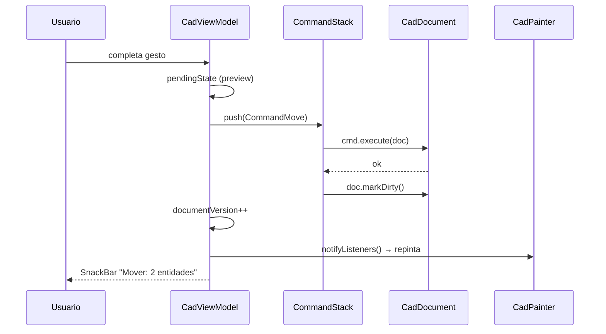

# Sistema de Edición — CAD Viewer & Editor

**Versión:** 0.3.1 · **Estado:** Aprobado (arquitectura técnica)
**Fecha:** 2026-07-31
**Propósito:** Diseño completo del subsistema de edición de la aplicación: patrón Command y undo/redo, selección múltiple, snapping, grips, línea de comandos, medición, creación de entidades, guardado y flujos de interacción. Es la especificación técnica para implementar las fases de edición del roadmap.

## Índice

1. [Principios](#1-principios-de-diseño-del-editor)
2. [Modelo de interacción](#2-modelo-de-interacción-dos-modos)
3. [Patrón Command y CommandStack](#3-patrón-command-y-commandstack)
4. [Selección múltiple](#4-selección-múltiple)
5. [Snapping](#5-snapping-snapengine)
6. [Grips](#6-grips-edición-directa)
7. [Línea de comandos](#7-línea-de-comandos-commandbar)
8. [Creación de entidades](#8-creación-de-entidades-flujos)
9. [Medición](#9-medición)
10. [Guardado y persistencia](#10-guardado-y-persistencia)
11. [Toolbar de edición](#11-estados-de-la-toolbar-de-edición)
12. [Táctil vs puntero](#12-interacción-táctil-vs-puntero)
13. [Casos de borde](#13-seguridad-de-edición-casos-de-borde)
14. [Checklist](#14-checklist-de-implementación-de-edición)

---

## 1. Principios de diseño del editor

1. **Todo cambio es un comando.** No existe mutación directa del documento fuera de `CommandStack` (ver ADR-0004).
2. **El usuario nunca pierde trabajo.** Undo/redo siempre disponible; autoguardado; diálogo de cambios sin guardar.
3. **Precisión primero.** Snapping, ortho, coordenadas relativas y grid como herramientas de entrada.
4. **Preview antes de commit.** Durante gestos (drag, creación), el canvas muestra una vista previa sin mutar el documento.
5. **Modelo de sesión separado del archivo.** `CadDocument` (editable) ↔ `CadFile` (persistible). Nada se escribe hasta "Guardar".

---

## 2. Modelo de interacción (dos modos)

```
┌─────────────────────────────────────────────┐
│  MODO NAVEGACIÓN (por defecto)              │
│  - Un dedo: pan        - Pinch: zoom        │
│  - Tap: seleccionar    - Doble tap: zoom+   │
├─────────────────────────────────────────────┤
│  MODO EDICIÓN (toolbar activa / comando)    │
│  - Tap: punto de entrada (con snap)         │
│  - Drag: crear/mover según herramienta      │
│  - ESC: cancelar / volver a navegación      │
└─────────────────────────────────────────────┘
```

- La **toolbar de edición** aparece contextualmente al seleccionar (o al tocar el botón de modo edición).
- La **línea de comandos** (command bar) permite invocar herramientas por teclado (desktop/tablet) o toque (móvil).

---

## 3. Patrón Command y CommandStack

### 3.1 Interfaz

```dart
abstract class CadCommand {
  String get description;              // "Mover 2 entidades"
  void execute(CadDocument doc);       // aplica el cambio
  void undo(CadDocument doc);          // revierte exactamente
  bool get changesDocument => true;    // false para comandos de vista (zoom)
}
```

### 3.2 Catálogo de comandos (v0.2/v0.3)

| Comando | execute | undo | Fase |
|---------|---------|------|------|
| `CommandCreate(entity)` | Añade entidad | La elimina | 0.2 |
| `CommandDelete(handles)` | Elimina entidades | Las restaura (captura previa) | 0.2 |
| `CommandMove(handles, delta)` | Desplaza | Desplaza −delta | 0.2 |
| `CommandRotate(handles, center, angle)` | Rota | Rota −angle | 0.2 |
| `CommandScale(handles, base, factor)` | Escala | Escala 1/factor | 0.2 |
| `CommandModifyProps(handle, propsBefore, propsAfter)` | Aplica props | Restaura propsBefore | 0.3 |
| `CommandLayerCreate/Delete/Rename/Color` | Capas | Revertir | 0.2/0.3 |
| `CommandCopy(handles, delta)` | Duplica + mueve | Elimina copias | 0.2 |
| `CommandTrim(handles, ...)` | Recorta | Restaura | 0.3 |
| `CommandOffset(entity, distance)` | Crea offset | Elimina | 0.3 |
| `CommandEditText(handle, old, new)` | Cambia texto | Restaura | 0.3 |

### 3.3 Semántica de undo

- **Snapshot (Memento):** comandos destructivos (DELETE, TRIM, MODIFY) capturan el estado previo de las entidades afectadas y lo restauran en `undo()`.
- **Inversa:** comandos transformativos (MOVE, ROTATE, SCALE) aplican la transformación inversa.
- **Límite:** 100 operaciones en `undoStack` (configurable). Al superar, se descarta la más antigua.
- **Al cargar archivo nuevo:** `commandStack.clear()`.
- **Comandos de vista (zoom/pan):** NO entran en la pila.

### 3.4 Flujo de commit (diagrama)



Flujo textual equivalente:

```
Usuario completa gesto → ViewModel.commits pending state
    ↓
cmd = CommandMove(...) → cmd.execute(doc)
    ↓
commandStack.push(cmd) → doc.markDirty()
    ↓
viewModel.documentVersion++ → notifyListeners()
    ↓
UI: SnackBar "Mover: 2 entidades" (opcional), botones undo/redo habilitados
```

---

## 4. Selección múltiple

### 4.1 Modos de selección

| Modo | Gesto | Comportamiento |
|------|-------|----------------|
| Tap | Tap sobre entidad | Selecciona (reemplaza selección) |
| Tap+Shift | Tap con Shift | Toggle de la entidad en la selección |
| Window (verde) | Drag de izquierda→derecha | Solo entidades completamente contenidas |
| Crossing (azul) | Drag de derecha→izquierda | Entidades que tocan el rectángulo |
| Todo | Ctrl+A | Selecciona todas las visibles descongeladas |
| ESC / tap vacío | — | Deselecciona |

### 4.2 Reglas

- Entidades en capa **locked/frozen** no son seleccionables.
- La selección se almacena como `Set<String>` de handles en `SelectionManager`.
- Al cambiar la visibilidad de capa, la selección conserva los handles (aunque no se rendericen).
- Al borrar una entidad seleccionada, se elimina de la selección.

### 4.3 Resaltado

- Halo azul discontinuo 2px + animación "respiración" 1s (ver `docs/DESIGN.md` §4.4).
- Grips visibles solo con selección activa (ver §6).

---

## 5. Snapping (SnapEngine)

### 5.1 Modos

| Modo | Descripción | Prioridad |
|------|-------------|-----------|
| `endpoint` | Extremos de líneas/arcos/polilíneas | 1 |
| `midpoint` | Punto medio de segmentos/arcos | 2 |
| `center` | Centro de círculos/arcos/elipses | 2 |
| `quadrant` | 0°/90°/180°/270° de círculos/arcos | 3 |
| `intersection` | Cruce de 2 entidades | 1 |
| `nearest` | Punto más cercano sobre la entidad | 4 |
| `grid` | Nodos de la rejilla | 5 |
| `polar` | Ángulos múltiplos de 15° (configurable) | 6 |
| `ortho` | Restricción a eje X/Y (no es un punto: es filtro de dirección) | — |

### 5.2 Algoritmo

```mermaid
flowchart TD
    A[cursor + candidates + settings] --> B[tolerancia px→mundo por zoom]
    B --> C[por cada modo activo x entidad visible]
    C --> D[computeSnapPoints modo/entidad]
    D --> E[mejor punto dentro de tolerancia]
    E --> F[recolectar SnapPoints]
    F --> G{¿intersección 2 entidades y modo activo?}
    G -->|sí| H[prioridad intersection]
    G -->|no| I[mayor prioridad del modo]
    H --> J{¿ortho activo y hay punto previo?}
    I --> J
    J -->|sí| K[proyectar cursor a eje X o Y]
    J -->|no| L[retornar SnapResult | null]
    K --> L
```

```
SnapResult? SnapEngine.snap(Point cursor, List<CadEntity> visible, SnapSettings settings)
1. tolerancia = settings.tolerancePx → mundo (según zoom)
2. candidatos = []
   para cada modo activo × entidad visible:
      puntos = computeSnapPoints(mode, entity)
      mejor  = punto más cercano a cursor dentro de tolerancia
      candidatos.add(SnapPoint(punto, entidad, modo))
3. si hay intersection (2 entidades distintas) y modo activo → prioridad
4. retorna el candidato de mayor prioridad; si ninguno → null
5. ortho: si modo ortho activo y hay punto previo → proyecta cursor a X o Y del punto previo
```

### 5.3 Rendimiento

- Cache de puntos de snap por entidad (recalculado al cambiar el documento o la visibilidad).
- Para archivos grandes: spatial index compartido con hit-testing.
- Máximo N entidades evaluadas por frame (p. ej., las 50 más cercanas vía index).

### 5.4 Indicador visual

- Marcador: cuadrado/rombo según modo (endpoint=cuadrado, midpoint=triángulo, center=círculo, intersection=X, nearest=rombo pequeño), color según tema (amarillo por defecto).
- Se dibuja en la capa overlay del painter (no afecta al dibujo).

### 5.5 Configuración (Settings)

- Activar/desactivar cada modo.
- Tolerancia en px (4–20, defecto 10).
- Ángulos de polar (15° por defecto, 5/10/30/45 opciones).
- Ortho on/off (atajo F8, como AutoCAD).

---

## 6. Grips (edición directa)

### 6.1 Diseño

- Al seleccionar una entidad se muestran sus **grips**: puntos de control editables.
- Grip "caliente" (tocado) = rojo/relleno; los demás = azul hueco.
- Arrastrar un grip ejecuta la transformación en vivo (preview) y al soltar crea el comando correspondiente.

### 6.2 Grips por tipo de entidad

| Entidad | Grips |
|---------|-------|
| LINE | 2 extremos (mover extremo) + grip central (mover línea) |
| CIRCLE | centro (mover) + grip en cuadrante (cambiar radio) |
| ARC | centro, 2 extremos (mover ángulo), punto medio (cambiar radio/barrido) |
| ELLIPSE | centro + 2 grips de ejes |
| LWPOLYLINE/POLYLINE | 1 grip por vértice + grip medio de segmento (insertar vértice) |
| TEXT/MTEXT | grip de inserción (mover) + grip de altura/rotación |
| INSERT | grip de inserción (mover), grips de escala, grip de rotación |
| DIM | grips de puntos de definición (mover cota) |

### 6.3 Comandos generados por grips

- Mover extremo de LINE → `CommandModifyProps` con nuevo punto.
- Cambiar radio de CIRCLE → `CommandModifyProps`.
- Mover vértice de polilínea → `CommandModifyProps`.
- Insertar/eliminar vértice → `CommandModifyProps` o comandos dedicados `CommandPolylineAddVertex`.

---

## 7. Línea de comandos (CommandBar)

### 7.1 Diseño UX

- Barra inferior colapsable (icono `>` o atajo `/` en desktop, tecla de comando en móvil).
- Muestra el **historial** de últimos comandos (scrollable).
- Campo de entrada con **autocompletado** de comandos conocidos.
- Soporta entrada de **coordenadas** durante comandos de dibujo.

### 7.2 Comandos (catálogo v0.3)

| Comando | Acción |
|---------|--------|
| `LINE`, `L` | Dibujar línea (puntos sucesivos, ESC termina) |
| `CIRCLE`, `C` | Círculo (centro + radio o 2 puntos) |
| `ARC`, `A` | Arco (3 puntos o centro+ángulos) |
| `ELLIPSE`, `EL` | Elipse |
| `POLYLINE`, `PL` | Polilínea |
| `TEXT`, `T` | Texto de una línea |
| `POINT`, `PO` | Punto |
| `ERASE`, `E` | Borrar selección |
| `MOVE`, `M` | Mover selección (base + destino) |
| `ROTATE`, `RO` | Rotar selección |
| `SCALE`, `SC` | Escalar selección |
| `COPY`, `CO` | Copiar selección |
| `MIRROR`, `MI` | Espejo (v0.3+) |
| `TRIM`, `TR` | Recortar (v0.3+) |
| `OFFSET`, `O` | Offset (v0.3+) |
| `DIST`, `DI` | Medir distancia |
| `ANGLE` | Medir ángulo |
| `AREA` | Medir área |
| `ZOOM` / `PAN` | Vista |
| `FIT` | Fit to screen |
| `LAYER` | Abrir panel de capas |
| `SNAP` | Configurar snaps |
| `ORTHO` | Toggle ortho (F8) |
| `UNITS` | Cambiar unidades |
| `SAVE` / `SAVEAS` | Guardar |
| `UNDO` / `REDO` | Deshacer / rehacer |
| `CLEAR` | Limpiar selección |
| `HELP` | Ayuda de comandos |

### 7.3 Entrada de coordenadas

| Sintaxis | Significado | Ejemplo |
|----------|-------------|---------|
| `10,20` | Absolutas | `LINE: 10,20` |
| `#10,20` | Absolutas (explícito) | `#10,20` |
| `@10,20` | Relativas al último punto | `@10,20` |
| `10<45` | Polares (distancia<ángulo grados) | `10<45` |
| `@10<45` | Polares relativas | `@10<45` |
| `10,20,5` | 3D (Z se ignora con nota) | — |

### 7.4 Atajos de teclado (desktop/tablet)

| Atajo | Acción |
|-------|--------|
| Ctrl+Z / Ctrl+Y | Undo / Redo |
| Ctrl+S | Guardar |
| Ctrl+C / Ctrl+V / Ctrl+X | Copiar / Pegar / Cortar |
| Ctrl+A | Seleccionar todo |
| DEL / Supr | Borrar selección |
| ESC | Cancelar comando / deseleccionar |
| F8 | Ortho toggle |
| F3 | Snap toggle |
| + / - | Zoom in / out |
| F | Fit to screen |

---

## 8. Creación de entidades (flujos)

### 8.1 Línea (ejemplo)

```
Toolbar/Comando: LINE
    ↓
Estado: "Specify first point" → tap (con snap) o coordenadas
    ↓
Vista previa: línea elástica desde punto 1 al cursor (rubber band)
    ↓
"Specify next point" → tap → se crea segmento (CommandCreate por segmento
  o CommandCreatePolyline al terminar con ESC/Enter)
    ↓
ESC/Enter/Espacio → termina (crea la entidad final y la deja seleccionada)
```

### 8.2 Círculo (centro + radio)

```
CIRCLE → centro (tap/snap) → radio (drag con preview del radio en vivo
  y lectura de valor en status bar) → suelta → CommandCreate(CadCircle)
```

### 8.3 Entidades creadas (v0.2): LINE, CIRCLE, ARC, ELLIPSE, LWPOLYLINE, TEXT, POINT

- Las nuevas entidades se crean en la **capa actual** (`CadDocument.currentLayer`).
- Color/lineType: **ByLayer** (sin override) por defecto.
- Al terminar, la entidad queda seleccionada (permite editar props de inmediato).

---

## 9. Medición

| Herramienta | Flujo | Resultado |
|-------------|-------|-----------|
| Distancia | 2 puntos (con snap) | Distancia en unidad de visualización + delta X/Y + ángulo |
| Ángulo | 3 puntos (vértice + 2 rayos) | Ángulo en grados |
| Área | Polígono por puntos o entidad cerrada seleccionada | Área en unidad² |

- Las mediciones se muestran: en el status bar, en una etiqueta temporal en canvas, y en un SnackBar.
- **No crean entidades** (las cotas temporales son overlay descartable).

---

## 10. Guardado y persistencia

### 10.1 Guardar (v0.2)

```
SAVE → ¿ruta original? (solo si se abrió desde ruta)
  Sí → sobrescribir con confirmación
  No → "Guardar como..." (file_picker save / diálogo de ruta)
    ↓
CadDocument.exportCadFile() → CadFile limpio
    ↓
Isolate: DxfWriter.write(version: R2000|R12) → String
    ↓
writeFile(path, content, flush: true)  → try-catch
    ↓
doc.markSaved() → SnackBar "Guardado correctamente"
```

### 10.2 Autoguardado

- Cada 5 minutos si `dirty == true` → guarda en `path_provider` (copia de seguridad temporal `*.autosave.dxf`).
- Al abrir, si existe autosave más reciente que el archivo → preguntar "¿Restaurar sesión anterior?".

### 10.3 Salida con cambios

- Si `dirty == true` al salir/abrir otro archivo → diálogo: Guardar / Descartar / Cancelar.

### 10.4 Versionado de guardado

| Opción | Uso |
|--------|-----|
| DXF R2000 | Por defecto (LWPOLYLINE, SPLINE, MTEXT, HATCH) |
| DXF R12 | Máxima compatibilidad (convierte LWPOLYLINE→POLYLINE; advierte sobre SPLINE/MTEXT) |

---

## 11. Estados de la toolbar de edición

```
[Selección vacía]        → toolbar oculta (solo botón modo edición)
[1 entidad seleccionada] → Mover, Rotar, Escalar, Copiar, Borrar, Propiedades, Duplicar
[>1 entidad]             → Mover, Rotar, Escalar, Copiar, Borrar, Agrupar(placeholder)
[Modo creación activo]   → toolbar de dibujo: Line, Circle, Arc, Ellipse, Polyline, Text, Point
```

- La toolbar flota (bottom center) con BackdropFilter blur, auto-ocultable.
- Los botones de acciones destructivas se confirman si hay undo disponible (no es necesario confirmar: hay undo).

---

## 12. Interacción táctil vs puntero

| Acción | Táctil | Puntero/teclado |
|--------|--------|-----------------|
| Seleccionar | Tap | Click |
| Zoom | Pinch / doble tap | Rueda / Ctrl+rueda, +/− |
| Pan | Un dedo | Arrastre / espacio+arrastre |
| Entrada de precisión | Snap + coordenadas en CommandBar | Teclado + CommandBar |
| Cancelar | Botón ✕ en toolbar | ESC |
| Menú contextual | Long-press | Click derecho |

---

## 13. Seguridad de edición (casos de borde)

1. Mover entidad a capa bloqueada → **no permitido** (se ignora o advierte).
2. Borrar entidades en capa bloqueada → no están seleccionadas (no seleccionables).
3. Undo tras borrado de capa → el comando restaura capa y entidades.
4. Rotación de INSERT con bloque → solo la instancia (no el bloque).
5. Editar entidad con extrusión no ortogonal → advertir "proyección 2D activa".
6. Crear entidad sin capa actual válida → forzar capa "0".
7. Archivo abierto solo lectura (path sin permisos) → forzar "Guardar como...".
8. Autosave corrupto → ignorar con aviso (no crash).

---

## 14. Checklist de implementación de edición

- [ ] `CommandStack` con límite 100, undo/redo funcionales
- [ ] Todos los comandos del catálogo v0.2 implementados y testeables
- [ ] Selección múltiple (tap, shift, window/crossing, Ctrl+A)
- [ ] SnapEngine con todos los modos y tolerancia configurable
- [ ] Ortho y polar operativos
- [ ] Grips por tipo de entidad (v0.3)
- [ ] CommandBar con autocompletado, coordenadas relativas/polares, historial
- [ ] Atajos de teclado desktop
- [ ] Medición: distancia, ángulo, área
- [ ] Guardado R2000/R12 con conversión de polilíneas
- [ ] Autoguardado + diálogo de cambios sin guardar
- [ ] Preview en vivo durante gestos (sin mutar el documento)
- [ ] Tests: CommandStack, cada comando (execute/undo), SnapEngine, hit-testing
