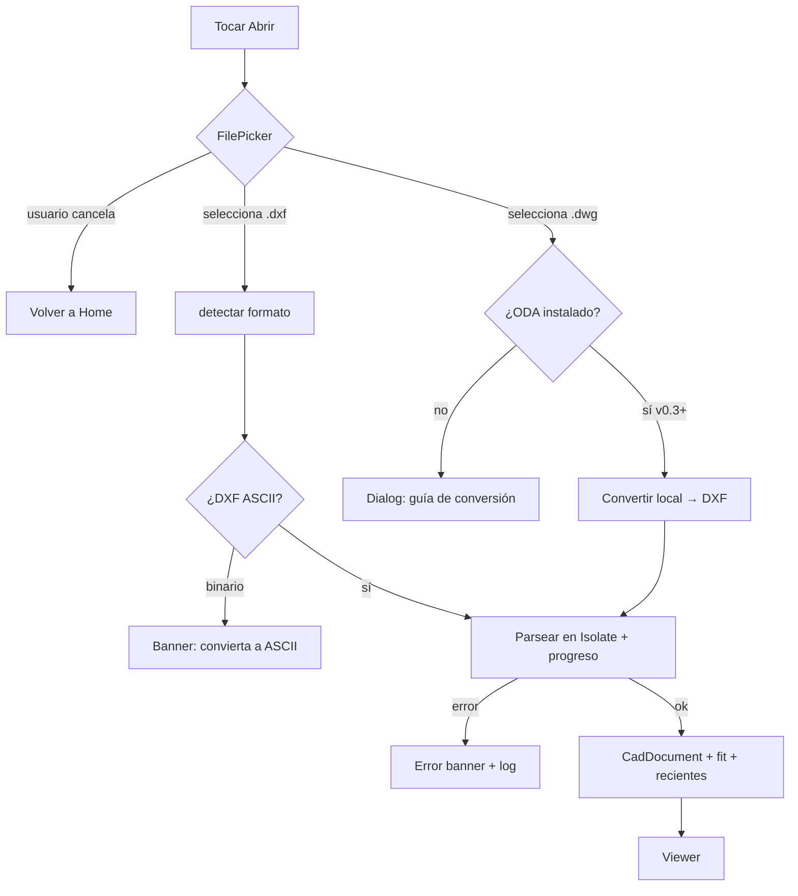
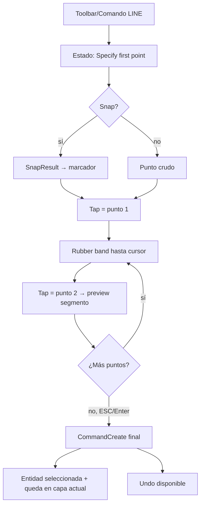
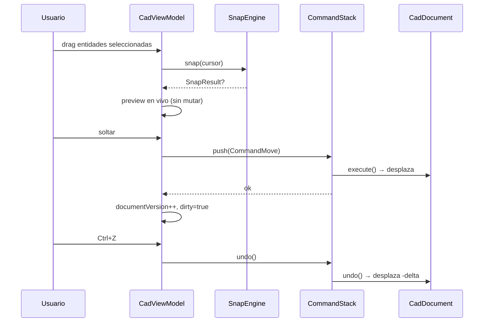
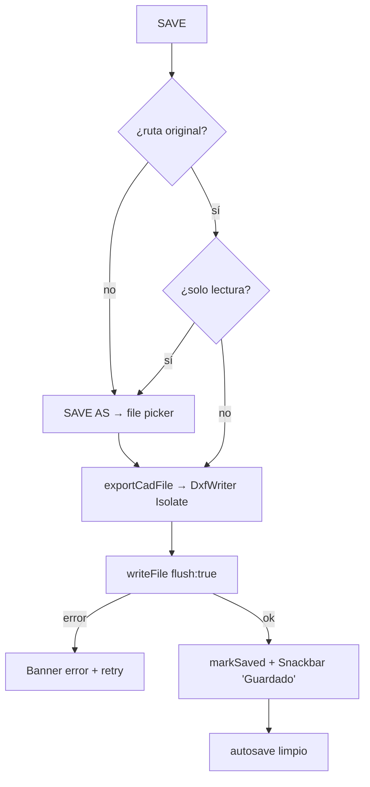

# UX Flows & Estados — CAD Viewer & Editor

**Versión:** 0.3.0
**Estado:** Aprobado (equipo UX)
**Equipo responsable:** UX Lead · IA · Content
**Propósito:** Personas, arquitectura de información, flujos de usuario (diagramas Mermaid), matriz de estados de UI, microcopy y ergonomía. Complementa a `docs/DESIGN.md` (visión) y `docs/DESIGN_SYSTEM.md` (tokens).

---

## Índice

1. [Personas](#1-personas)
2. [Arquitectura de información](#2-arquitectura-de-información)
3. [Flujos de usuario](#3-flujos-de-usuario)
4. [Matriz de estados de UI](#4-matriz-de-estados-de-ui)
5. [Microcopy y voz](#5-microcopy-y-voz)
6. [Ergonomía multi-touch y pen](#6-ergonomía-multi-touch-y-pen)

---

## 1. Personas

| | **María, Arquitecta** | **Jorge, Ingeniero estructural** | **Leo, Delineante freelance** | **Sofía, Estudiante de diseño** |
|---|---|---|---|---|
| **Rol** | Arquitecta sénior, revisa planos en obra | Ingeniero, verifica cálculos y cotas | Delineante, ajusta planos para clientes | Estudiante, aprende CAD |
| **Contexto** | Tablet + pen, iluminación variable, guantes a veces | Desktop + mouse, pantalla grande, multitarea | Laptop, trabaja con LibreCAD | Teléfono + tablet, tutoriales |
| **Objetivos** | Verificar dimensiones rápido; marcar correcciones; compartir con equipo | Medir distancias/ángulos con precisión; inspeccionar capas por disciplina | Editar planos ligeros (mover, añadir textos); entregar DXF compatible | Explorar sin miedo; tutorial; exportar PNG para presentar |
| **Frustraciones** | Archivos DWG de clientes que no puede abrir; zoom lento | Capas mal ordenadas; sin línea de comandos | Miedo a romper el plano; falta de undo | Interfaces abrumadoras; mensajes técnicos sin explicación |
| **Feature clave** | DWG (ODA), fit rápido, compartir | Medición, snap preciso, unidades | Edición con undo, guardado R12, capas | Onboarding, temas, empty states amigables |
| **Escenario típico** | Abre DWG en obra → fit → mide dos vanos → comparte | Abre R2000 → oculta capas de mobiliario → mide luces | Abre DXF LibreCAD → mueve mobiliario → guarda R12 | Abre ejemplo → sigue onboarding → exporta PNG |

**Decisiones de diseño que justifican:** pen support (María), línea de comandos (Jorge/Leo), undo siempre visible (Leo), estados amigables (Sofía), estrategia color-blind (Jorge en obra).

---

## 2. Arquitectura de información

```
CAD Viewer & Editor
├── Home
│   ├── Abrir archivo (picker)
│   ├── Recientes (lista horizontal)
│   └── Ajustes (sheet)
│       ├── Tema (6) · Unidades · Grid · Ejes
│       ├── Snap (modos, tolerancia, polar)
│       └── Acerca de / Privacidad
└── Viewer
    ├── AppBar: ← · nombre · fit · info
    ├── Canvas (capas overlay: grid, ejes, entidades, selección, grips, snap)
    ├── StatusBar: coordenadas · snap · medidas
    ├── ZoomControls (flotante)
    ├── ToolbarEdit (contextual)
    ├── CommandBar (colapsable)
    ├── LayerPanel (sheet/lateral)
    └── PropertyPanel (sheet/ventana)
```

**Política de navegación:**
- Home → Viewer: push con fade-through.
- Back del Viewer: si `dirty` → diálogo "¿Guardar?".
- Paneles: modales (sheets) en móvil; laterales persistentes en landscape/desktop.
- El estado de vista (zoom/pan) se preserva al rotar; el documento nunca se recarga.

---

## 3. Flujos de usuario

> Diagramas Mermaid (renderizan en GitHub). Cada flujo incluye caminos de error y cancelación.

### 3.1 Abrir archivo



### 3.2 Selección

```mermaid
flowchart TD
    A[Tap en canvas] --> B{¿Entidad bajo cursor?}
    B -->|no| C[Limpiar selección]
    B -->|sí, capa locked| D[No seleccionar + hint sutil]
    B -->|sí| E[Seleccionar (reemplaza)]
    A2[Shift+tap] --> E2[Toggle en selección]
    A3[Drag derecha→izq] --> F[Crossing: toca rectángulo]
    A3b[Drag izq→der] --> G[Window: contenido]
    A4[Ctrl+A] --> H[Seleccionar todas visibles]
    A5[ESC] --> I[Limpiar]
    E --> J[ToolbarEdit + PropertyPanel + grips]
```

### 3.3 Crear línea (con snap)



### 3.4 Mover con undo



### 3.5 Guardar



---

## 4. Matriz de estados de UI

### 4.1 Estados por pantalla

| Pantalla | Empty | Loading | Error | Success | Offline/limitado |
|----------|-------|---------|-------|---------|------------------|
| **Home** | Sin recientes: icono folder + "Tus planos aparecerán aquí" + CTA Abrir | — | Fallo al leer recientes: mostrar vacío, no bloquear | — | — |
| **Viewer (sin dibujo)** | Icono + "Abre un plano para comenzar" | Splash/logo + spinner durante parseo | Banner: archivo inválido/corrupto + "Abrir otro" | — | — |
| **Viewer (dibujo sin entidades)** | "Este dibujo no contiene entidades" + sugerencia capas | — | — | — | — |
| **LayerPanel** | "No hay capas" (solo capa 0 implícita) | Spinner al cargar | Error de capa borrada | Toggle aplicado (sutil) | — |
| **PropertyPanel** | Sin selección: "Toca una entidad para ver sus propiedades" | — | — | Cambio de propiedad aplicado (Snackbar breve) | — |
| **CommandBar** | Sin historial: "Escribe un comando (escribe HELP)" | Spinner 16dp en comando pesado | Error de comando: línea en rojo + mensaje | "MOVE OK" / "SAVE OK" | — |
| **Guardado/Export** | — | Spinner en botón Guardar | Banner: permisos/solo lectura | Snackbar "Guardado" | — |
| **DWG** | — | "Convirtiendo DWG…" con progreso | "No se pudo convertir" + guía | "Convertido correctamente" | Sin ODA: guía de instalación |

### 4.2 Transiciones de estado (reglas)

1. Todo estado `error` tiene: mensaje legible + acción de recuperación + log.
2. Todo estado `loading` > 300 ms muestra indicador; > 3 s muestra progreso o "cancelar".
3. `empty` nunca es un callejón: siempre hay un CTA o ayuda.
4. `success` es discreto (Snackbar 4 s) salvo operaciones destructivas (confirmación).
5. `offline/limitado` aplica solo a DWG (conversión externa): nunca a DXF local.

---

## 5. Microcopy y voz

### 5.1 Voz de la app

- **Tono:** profesional, preciso, directo. Sin jerga innecesaria; sin tono informal.
- **Idiomas:** es (es-419) y en (en-US) en v1.0; ARB desde el inicio.
- **Regla de oro:** el mensaje dice *qué pasó* y *qué puede hacer el usuario*.
- **Nunca:** mensajes técnicos crudos ("ParseException: ...") ni culpar al usuario.

### 5.2 Catálogo de mensajes clave (es/en)

| Contexto | Español | English |
|----------|---------|---------|
| Confirmación de salida con cambios | "Tienes cambios sin guardar. ¿Guardar, descartar o cancelar?" | "You have unsaved changes. Save, discard, or cancel?" |
| Error de archivo | "No se pudo leer el archivo. ¿Es un DXF válido?" | "Couldn't read the file. Is it a valid DXF?" |
| DWG sin converter | "DWG requiere conversión. Instala ODA File Converter o convierte a DXF." | "DWG requires conversion. Install ODA File Converter or convert to DXF." |
| Guardado OK | "Guardado correctamente" | "Saved successfully" |
| Borrar selección | "¿Eliminar N entidades? (Ctrl+Z para deshacer)" | "Delete N entities? (Ctrl+Z to undo)" |
| Comando no encontrado | "Comando desconocido. Escribe HELP para ver la lista." | "Unknown command. Type HELP to see the list." |
| Undo | "Deshecho: Mover 2 entidades" | "Undone: Moved 2 entities" |
| Redo | "Rehecho: Mover 2 entidades" | "Redone: Moved 2 entities" |
| Snap activo | "Snap: END" (status bar) | "Snap: END" |
| Empty Home | "Tus planos aparecerán aquí" | "Your drawings will appear here" |
| Empty viewer | "Abre un plano para comenzar" | "Open a drawing to get started" |
| Sin entidades | "Este dibujo no contiene entidades" | "This drawing contains no entities" |
| Error permisos guardado | "No se puede guardar aquí. Usa 'Guardar como'." | "Can't save here. Use 'Save As'." |

### 5.3 Consistencia de términos

| Término canónico (es) | Alternativas prohibidas |
|------------------------|--------------------------|
| Capa | layer, estrato |
| Entidad | objeto, elemento, figura |
| Guardar como | Save As, Exportar DXF (exportar = PNG/PDF) |
| Deshacer / Rehacer | Undo / Redo (solo en atajos) |
| Ajuste a pantalla | Fit, encuadrar |
| Snap | magnetismo, ajuste |

---

## 6. Ergonomía multi-touch y pen

### 6.1 Zonas de pulgar (móvil)

```
┌─────────────────────────────┐
│ [appbar]              (x)   │  zona superior: navegación
│                             │
│                             │
│   (canvas)                  │
│                             │
│  [toolbar]     [zoom]  (ok) │  zona inferior: acciones frecuentes
└─────────────────────────────┘
```

- **Acciones frecuentes** (zoom +/−, fit, capas, undo) → franja inferior (zona verde de pulgar).
- **Acciones destructivas** (borrar, guardar sobre) → nunca en zona de pulgar; requieren confirmación.
- Toolbar contextual de edición → bottom-center, alcance natural del pulgar.

### 6.2 Pen / stylus (tablet, crítico para CAD)

| Capacidad | Spec |
|-----------|------|
| Hover preview | Mostrar preview del comando en curso bajo el pen (sin tocar) |
| Precisión | Hit-testing usa punto exacto del pen, no dedo |
| Palm rejection | Descartar toques de palma durante strokes (platform API) |
| Botón del pen | Configurable: secondary = pan / context menu |
| Gestos de pen | Trazo = dibujar en modo creación; sin doble-tap conflictivo |

### 6.3 Diferencias por dispositivo

| Dispositivo | Navegación | Entrada de precisión | Atajos |
|-------------|------------|----------------------|--------|
| Móvil | Touch | Snap + CommandBar táctil | Solo touch |
| Tablet | Touch + pen | Pen + snap | Touch + pen button |
| Desktop | Mouse + teclado | Teclado (coordenadas) + mouse | Ctrl+Z/Y, F3, F8, ESC, +/− |
| Web | Mouse + teclado | Igual que desktop | Igual + limitaciones |

### 6.4 Reglas de gestos

1. Un dedo pan, dos pinch (nunca invertir).
2. Doble toque = zoom +2x centrado (nunca seleccionar).
3. Long-press en entidad = seleccionar + menú contextual (móvil); clic derecho (desktop).
4. ESC cancela el comando en curso, luego deselecciona (dos niveles).
5. No hay gestos destructivos sin confirmación o undo.

---

## Checklist de conformidad UX

- [ ] Todos los flujos tienen caminos de error y cancelación
- [ ] Matriz de estados cubre las 5 variantes en todas las pantallas
- [ ] Microcopy en es/en con tono consistente
- [ ] Zonas de pulgar respetadas en móvil
- [ ] Pen support especificado para tablet
- [ ] Back navigation con diálogo de cambios sin guardar
- [ ] Empty states con CTA en todas las pantallas
